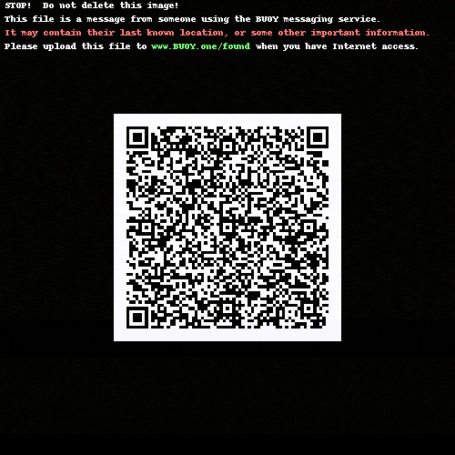

# Buoy

An emergency message format.

[buoy.one](http://buoy.one/)

# Example
Here is an example Buoy message:

The image is 500 x 500 pixels, and is very small, at 307KB.

- The file above displays:
    - Delivery instructions (as visible text)
    - A QR code (containing sender info, date/time, GPS coordinates, and more)

- The file above also _contains_:
    - A redundant copy of the QR code contents: [0-qr.txt](example/poc.png.contents/0-qr.txt) (241 bytes)
    - User-defined text: [1-text.txt](example/poc.png.contents/1-text.txt) (35 bytes)
    - 2 minutes of user-defined audio: [2-audio.m4a](example/poc.png.contents/2-audio.m4a) (196 KB)
    - A user-defined photo: [3-image.png](example/poc.png.contents/3-image.png) (42 KB)

Those additional contents are encoded in the 8 least-significant bits of each pixel in the Buoy image.  (See: steganography)

# Goals
- human-"friendly"
    - meaning a human can see the file and understand what it is, and what to do
    - does not mean totally human friendly
- multimedia support
    - text, gps
    - audio, image
    - video
- robust; qr code for essential data
    - if message is printed/screenshotted
    - less essential data xor'd within image (a la steganography)
- flexible delivery
    - image format
    - can be Airdropped, or otherwise sent over Bluetooth
    - should be friendly between devices/manufacturers/carriers
- dynamic
    - public and/or private info
    - optional delivery instructions (server, email, IP, etc.)
    - optional sender info
    - ?
